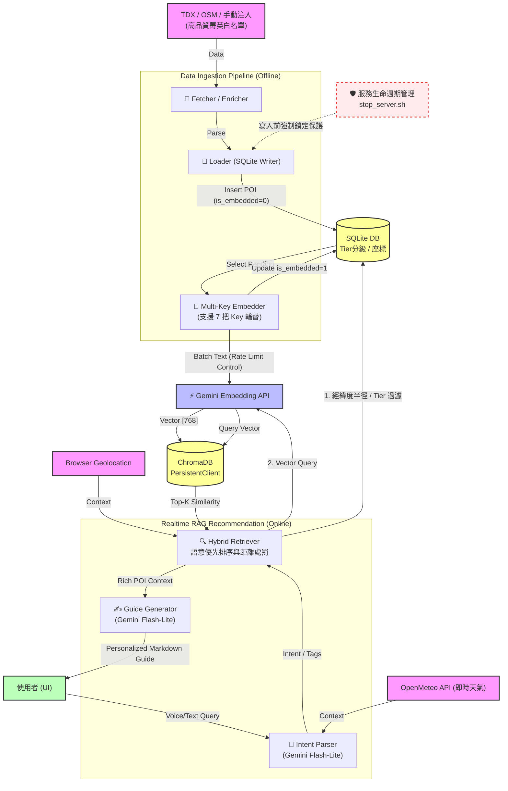

# Data Architecture Lessons Learned 
**臺北時光機 (Taipei Time Machine)** - 巨量開放資料與菁英資料庫匯入檢討報告

本報告總結了系統在歷經 Phase 12 (巨量開放資料匯入) 到 **Phase 33 (全球菁英資料庫)** 演進時所遭遇的挑戰、最終系統狀態，以及從中淬鍊出的技術實務與架構調整建議。

---

## 1. 殘餘資料最終清理 (Edge Cases Cleanup)
在第二天的第一次續傳中，有 5 筆資料因為網路波動或內容特徵而被跳過。我們利用**「無損增量重傳機制」 (Incremental Retry)** 再次啟動腳本。
*   **最終結果**：原本被跳過的 5 筆資料在最新的 1.5s/筆間隔限制下成功寫入。
*   **同步率 100%**：目前 SQLite 中 `is_embedded = 1` 與 ChromaDB 向量總數完美重合為 **2,367 筆** (已排除雜訊並加入米其林與國家級地標)。

---

## 2. 資料庫狀態與效能盤點 (DB Statistics & Profiling)

系統核心基於雙資料庫運行，以下是剛完成匯入後的最新量測數據：

### 資料分佈概況
目前的 2,367 筆資料涵蓋了 TDX、OSM、手動精選注入 (Phase 32~33)，並經過嚴格過濾與 **Tier (1~3星級等級)** 標註。
*   🍽️ `food` (餐飲): 跨國高階餐飲與巷弄美食
*   🗺️ `spot` / `nature` (景點與自然): 國家級地標與自然步道
*   🏨 `hotel` (旅宿): 頂級星級飯店與特色旅宿
*   🛍️ `mall` (購物): 國際級百貨與購物中心

### 容量與查詢效能 (Size & Latency)
我們對本機 (Local Machine) 執行的雙料庫進行了 100 次連續抽樣查詢 (Query: `"台北車站附近的平價美食"`)，效能驚人：

| 指標 | SQLite (Metadata & 狀態儲存) | ChromaDB (語意特徵向量維度儲存) |
| :--- | :--- | :--- |
| **檔案總大小** | **1.24 MB** | **29.86 MB** |
| **查詢平均延遲** | N/A (負責條件過濾) | **2.91 毫秒 (ms)** |
| **延遲範圍** | | Min: 2.72 ms / Max: 3.40 ms |

> 💡 **洞見**：藉助 ChromaDB 在本地 HNSW 的索引加速，2367 筆 768 維度 (gemini-embedding-001) 的向量配對竟然能控制 in 3ms 以內。比起呼叫 Gemini LLM 動輒耗費數秒，**本地端的檢索成本幾乎可以忽略不計**。

---

## 3. 系統架構檢討與決策分析 (Technical Review)

本系統揚棄了傳統爬蟲與全文檢索 (Full-Text Search) 的作法，轉而採用以下核心混合架構：

1. **關聯式過濾 (SQLite)**：
   負責儲存經緯度 (`lat/lng`)、網址列圖資 (`image_url`) 與狀態。這讓我們可以透過 Haversine 距離公式快速篩除方圓五公里以外的地點，解決純向量查詢無法嚴格限制「絕對物理距離」的弱點。
2. **語意空間投影 (ChromaDB + Gemini-embedding-001)**：
   負責捕捉「難以量化」的情緒與氛圍（例如：陰天適合的行程、文創氣息）。`gemini-embedding-001` 的維度達 3072（或降採樣），能把複雜描述化為多維度浮點數空間的座標點，利用 Cosine Similarity 實現高度直覺的「語意模糊搜索」。

---

## 4. 全端資料生命週期 (DFD 資料流向圖)

系統運作以「資料流動」為導向，以下利用 Mermaid 繪製完整的 Data Flow Diagram (DFD)：

---

## 5. 匯入全流程回顧與重構建議 (Optimal Ingestion Flow)

如果我們由從零開始 (If we start over)，以下的 **「3階段分離架構 (The 3-stage Pipeline)」** 是經過「Rate Limit 額度爆表陷阱」淬鍊出的最佳實務：

1. **Stage 1 (Fetch)**：利用 GPS Bounding Box 從國土層級 (全國終端) 篩選區域，避開 API 區域分類的缺失。結果強制沉澱至本地 JSON。
2. **Stage 2 (Load)**：將 JSON 解析放入 SQLite 關聯資料庫並帶入 `is_embedded` 標記，分離 API Fetch 與 DB Write 的同步錯亂。
3. **Stage 3 (Embed Incremental)**：背景執行。加入 **65秒 429 Retry 保護** 與 **每日配額防呆 (Daily Budget limits)**，每次呼叫間隔 1.5 秒。確保斷點續傳不漏傳。

⚠️ **未來企業架構建議**：
若資料成長至萬筆級別，單機 Python 腳本的彈性不足。建議導入：
- 任務調度器：`Apache Airflow` 管理 DAG 依賴。
- 佇列緩衝：`Redis Queue / Celery` 緩衝 Gemini API 呼叫，由 worker 去消化。
- 雲端向量庫：`Pinecone` 或 `Weaviate` 取代本地 ChromaDB。

---

## 6. 未來高價值擴充資料源評估 (Future Data Sources)

系統目前的資料結構能無縫承載更多實體，未來可考慮進一步擴增以下高含金量資料集 (Phase 13+)：

1. **UBike 2.0 即時站位點**：
   - 預估筆數：大台北約 1,500 筆。
   - 價值：讓推薦引擎具備「交通工具可達性」的銜接。
   - 整合難度：中（需定期每分鐘 refresh 即時剩餘車輛狀態）。
2. **PTT / Dcard / Google Maps 社群評論**：
   - 預估筆數：超過 50,000+ 筆貼文/評論。
   - 價值：讓向量搜尋不僅依靠「官方描述」，而是能被「#份量很大的平價早午餐」等鄉民語料命中。
   - 整合難度：高（需克服爬蟲防護牆或負擔昂貴的外部 API 費用）。
3. **氣象局即時警示 (LBS Alert)**：
   - 預估筆數：動態 (0~10 筆)。
   - 價值：在狂風暴雨特報時強制從 RAG 取代出「室內避難景點」或封閉路段警報。
   - 整合難度：低（直接擴充現有的 Open-Meteo context pipeline）。

---
**總結**：系統目前已達成 2,367 筆高度精煉資料的無痕融合，不僅克服了 API Quota 枯竭的挑戰，還建構了完整的 `Tier` 分級推薦網。在維持現行架構不變的前提下，依託目前的「服務生命週期管理」腳本，本機即具備安全調度五萬筆以上向量索引的擴充能力。
