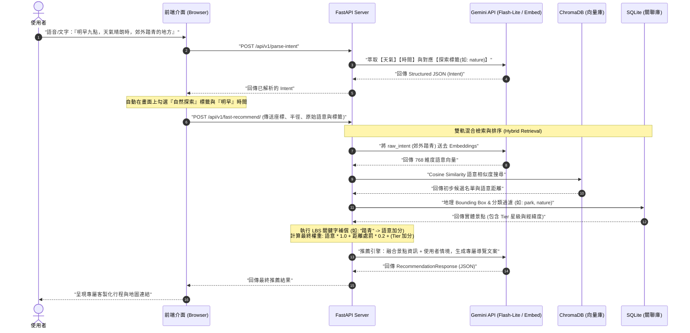

# 系統流程圖 (Process Flows)

本文件展示了「臺北時光機」最核心的 **魔法連動 (Agentic UI) 與 Semantic RAG 推薦流程**。

## 核心互動循序圖 (Sequence Diagram)

這個流程展示了使用者對著手機說出一句話後，系統如何在幾秒鐘內完成「意圖理解、介面自動填寫、語意融合檢索、LLM 創意生成」的完整迴圈。

## 流程設計亮點說明
1. **自動化 UI 更新 (Step 4-7)**：捨棄傳統「使用者填完表單才按下搜尋」的模式。系統會主動理解語意，幫使用者「畫面上」勾選好選項後，才交給後端處理，提供極佳的視覺反饋。
2. **混合檢索與權重 (Hybrid Retrieval)**：雖然前端幫忙勾選了「自然探索」，但後端真正在搜尋資料庫時，會直接拿使用者的原始語句（例如：郊外踏青）做 ChromaDB 的向量對比，並且在 SQLite 回傳資料後施加「Tier 菁英優待」以及「0.2公里的距離處罰折扣」，確保優質的遠方景點能擊敗普通的近身景點。
