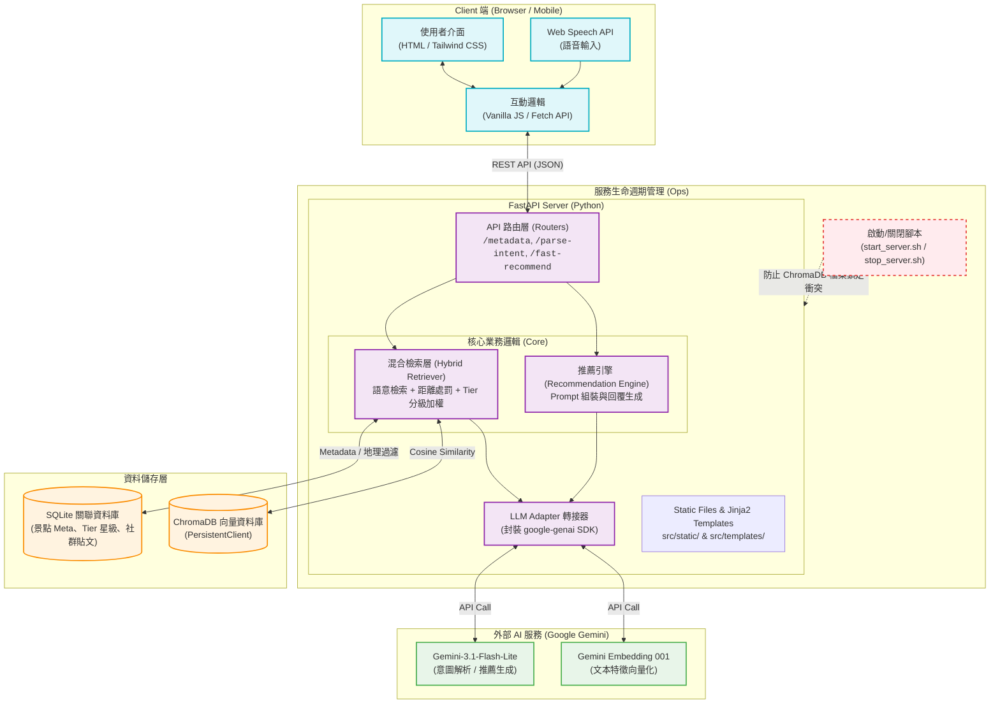

# 系統架構圖 (System Architecture)

本圖具象化了「臺北時光機」在 **Phase 33 準備階段** 的完整架構。系統採用了現代化的 **Hybrid RAG (混合檢索增強生成)** 架構，並結合前端 **Agentic UI (代理化介面)** 體驗。

## 架構設計亮點說明
1. **Frontend**: 零建置工具 (Zero-build) 架構，僅依靠瀏覽器原生的 Web Speech API 與 Fetch API 即可完成極高互動性的 Agentic 體驗。
2. **LLM Adapter**: 透過轉接器模式隔離了外部 SDK 的變動風險（例如我們在開發過程中無縫克服了 Free Tier Quota 的問題與新舊 SDK 的過渡）。
3. **Dual-Database 策略**: 
   - **ChromaDB**: 負責處理人類模糊、自然語言的「語意比對」(例如："想找個安靜的地方避雨")。
   - **SQLite**: 負責儲存結構化的實體關聯資料 (如精確的經緯度、分類標籤、店家實際介紹等)。
   - **Retriever (檢索層)** 會將兩者完美 Join，提供給 LLM 最豐沛的 Context。
