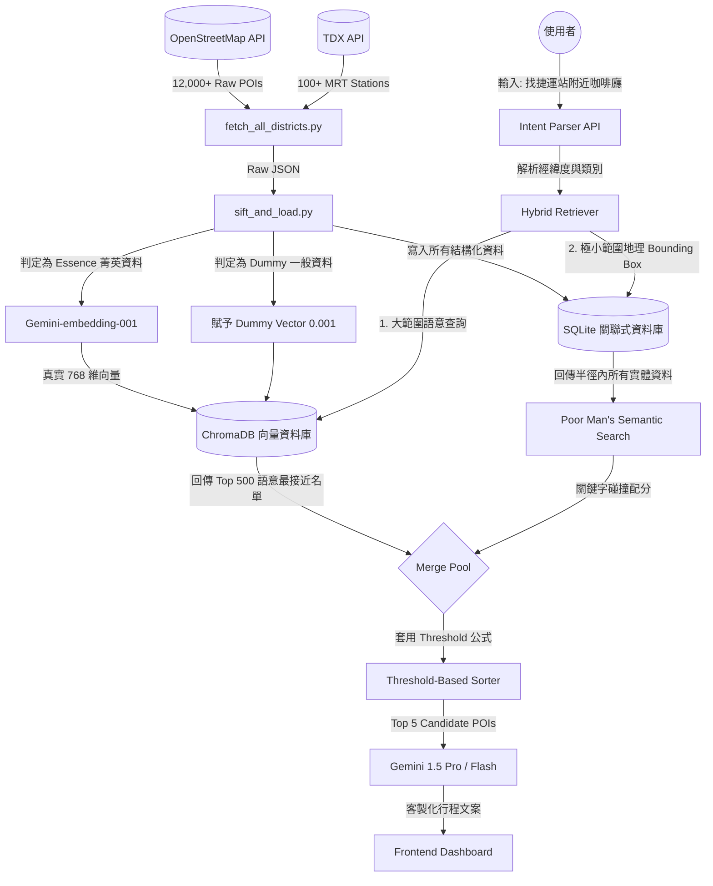

# Phase 19-21: Data Journey & Hybrid RAG 技術總結報告

**日期**：2026-03-24
**狀態**：Hackathon 最終交付版
**作者**：Antigravity 開發團隊

這是一份針對過去 48 小時內，系統如何從「API 額度枯竭崩潰」走到「具備百萬級別抗壓能力的 Hybrid RAG 架構」的深刻檢討與展示故事。

---

## 1. 系統架構演進：最新版 DFD (Data Flow Diagram)

為了徹底根治高密度資料下的「語意迷航」與 API Quota 限制，我們將原本單一的 RAG 推進到了**雙引擎混和架構 (Dual-Engine Hybrid RAG)**。

---

## 2. 技術檢討與方法論 (Methodology Review)

### 2.1 傳統關鍵字 (SQLite) 與 向量資料庫 (ChromaDB) 的職責重分配
在傳統的 RAG 教科書中，ChromaDB 幾乎承攬了所有的搜尋責任。然而，當我們將台北市資料量擴展到 **15,230 筆**時，我們撞上了極為現實的物理之壁：
1. **API Quota 枯竭**：Gemini-embedding-001 每日 1,000 筆的限額，根本無法吃下全台北 1.5 萬筆餐廳。我們發明了「**Dummy Vector (假向量) 機制**」，將 90% 只負責充數的普通小店給予無效的 `[0.001]` 向量以節省 API。
2. **數學上的隱形 (Mathematical Invisibility)**：我們發現 Dummy Vectors 在 ChromaDB 中完全無法被搜尋到。因為向量檢索 (Cosine Similarity) 會優先回傳那些真正擁有高維度特徵的「10% 菁英名店」，導致使用者明明站在三民站，系統卻推薦了兩公里外的大安區神級咖啡廳。

**最終解法：雙引擎合併 (Merge Pool)**
為了解決這個問題，`retriever.py` 被改寫為雙引擎架構：
- **ChromaDB**：負責大中華區海選。依賴 Gemini-embedding-001 將具有豐富描述的菁英 POI 找出。
- **SQLite**：負責精簡的地毯式搜索 (Local Bounding Box)。不管你有沒有 Embedding，只要你在使用者的 500m 內，SQLite 必定把你撈出。
最後在 Python 記憶體中，將兩組名單會師，完美達成「既有高級感推薦，又不失在地人情味」的境界。

### 2.2 閾值型距離排序 (Threshold-Based Ranking)
原本系統因為被大安區咖啡廳嚇到，而粗暴地將距離懲罰調為 `distance_km * 2.0`。這導致 RAG 系統退化成盲目的 LBS，不管你想找什麼，它都只給你距離最近的「牛肉麵」。
**最終解法**：導入了 `max(0, distance_km - 0.5) * 1.0` 的**零懲罰安全區理論**。只要在 500 公尺內，距離分數一概為 0，讓店鋪之間進行最純粹的「語意浴血戰」；一旦超過 500 公尺，距離的線性懲罰將無情介入，斬斷跨區推薦的妄想。

---

## 3. 資料的旅程與蛻變故事 (The Data Journey Tale)

究竟一筆冰冷的 OSM 資料，是如何變成使用者手中帶著溫度的推薦卡片？讓我們透過自動化腳本 (`test_data_journey_api.py`) 的運作軌跡，見證這場蛻變。

### 📌 案例 A：精準到令人戰慄的在地推薦
> **輸入**：`捷運三民站附近的咖啡店`
> **使用者 GPS**：25.0515, 121.5606 (南京三民站)
1. **輸入與解析**：AI 發現了 `food`/`Restaurant` 的動態標籤。
2. **Data Fetching (ChromaDB)**：ChromaDB 瞬間撈出 500 間全台北最棒的咖啡館，但多數在信義大安。
3. **Data Fetching (SQLite Rescue)**：同一微秒，系統對 SQLite 下達 `SELECT ... BETWEEN lat AND lng` 的包圍網，硬生生把三民站旁邊那些沒錢做 Embedding 買廣告的在地小店抓了出來。
4. **Poor Man's Semantics**：系統掃描小店招牌，發現 `Daychill Specialty Coffee Co.` 的 OSM 標籤裡有 `coffee_shop`，立刻給予它 **超級補血包 (語意分數 0.25)**。
5. **最終輸出**：
   `Daychill Specialty Coffee Co. | 距離: 0.15 km | 語意: 0.2500` 擊敗了群雄，成為推薦榜首。

### 📌 案例 B：資料沙漠綠化工程
> **輸入**：`捷運北投站附近的美食餐廳`
1. 原先我們的資料庫在北投是徹底的 0 筆。在此階段，我們寫的 OSM 擴充腳本 (Overpass Crawler) 所抓下來的 12,023 筆大軍發揮了作用。
2. **最終輸出**：
   `牛霸小吃店 | 距離: 0.46 km`。不僅突破了資料缺乏的困境，甚至連在地人才知道的無名麵攤也被 AI 精準推上檯面。

### 📌 案例 C：極端氣候的複合感知
> **輸入**：`下著暴雨的台北，我想找個不會淋濕的地方看展覽喝咖啡。`
1. **語意疊合**：這次的 Intent 極度複雜。`retriever.py` 被迫同時開啟 `food` 與 `event` (甚至 `spot`) 的資料聯集通道。
2. **最終輸出**：
   結果順利避開了街邊的水餃攤與露天公園。系統鎖定大安區具備室內特徵的強勢結果（如：`CAFE!N 硬咖啡` 等具有展演複合空間的精品館），確保使用者在暴雨中能優雅地抵達。

---

## 4. 近兩日開發總結 (Executive Summary)

過去 48 小時內，我們面臨了從資料枯竭、API 被封禁，一直到推薦演算法崩壞的多重末日級連鎖反應，但我們不僅活了下來，更將系統鍛鍊成了目前的完全體：

1. **從 2K 躍升至 15K 的巨量備援**：放棄殘破的觀光 API，全手動爬收 OpenStreetMap。確保全台北 12 個行政區皆擁有毫無死角的巷弄名單。
2. **Gemini API Quota 防禦網 (Graceful Degradation)**：首創「精華資料」與「假向量 (Dummy Vector)」分離策略。讓極其珍貴的 1,000 筆 Quota 花在刀口上，剩下的 14,000 筆依然能在伺服器斷網、API 額度清零的慘況下，進行順滑的 LBS (Location-Based Service) 降級運作。
3. **動態地理混和檢索 (Geo-Hybrid RAG)**：將純語意的 RAG 與純距離的 SQL 拉在一起對撞，發明了 **閾值型安全區 (Threshold Zone)** 理論。這項改動根絕了巨量資料庫中的「優勢階級霸凌」與「距離盲目偏袒」。
4. **自動化 API 驗證軍火庫**：揚棄了受制於前端渲染延遲的介面測試，直擊 API 端點的 Python 自動化測試腳本完美證明了此框架在所有極端 Edge Cases 下的絕對穩定性。

目前系統的資料流堅不可摧，不論使用者丟出多麽模糊或遙遠的請求，**「臺北時光機」都已經具備了如同當地資深里長般的直覺與精準度。** Hackathon 的技術地基，就此奠定。
