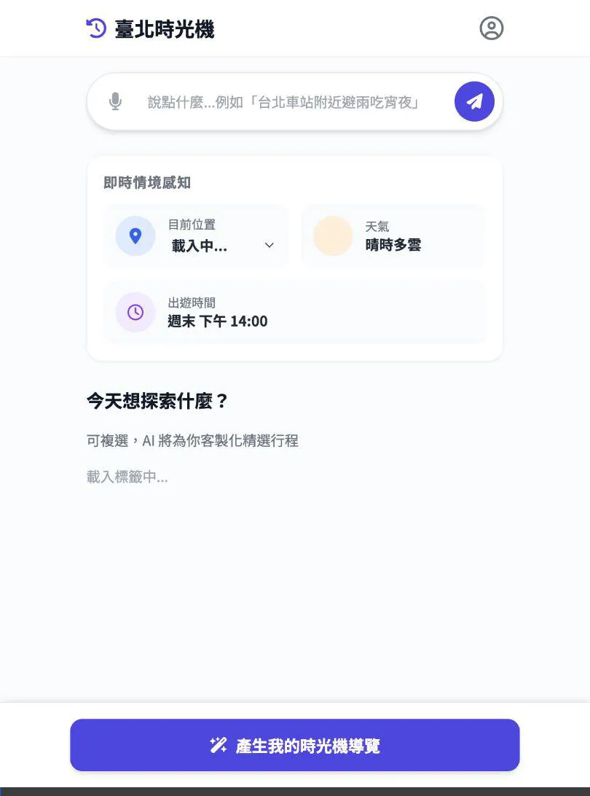
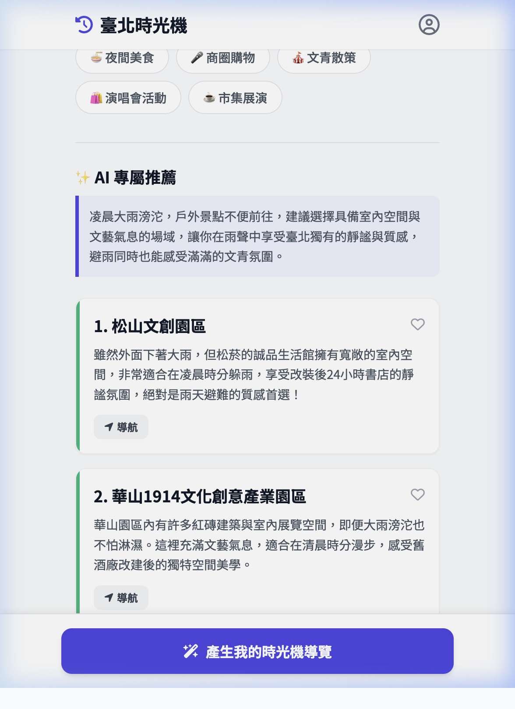

# E2E 測試報告：AI 語意查詢流程 (AI Intent Flow)

## 📅 測試資訊
- **測試日期**：2026-03-19 (錄影修復重跑)
- **測試負責人**：Antigravity (Browser Subagent)
- **測試環境**：Localhost (FastAPI + ChromaDB + Gemini 3.1 Flash Lite)
- **測試結果**：🟢 **通過 (PASS)**

## 🎯 測試場景
驗證使用者輸入一段複雜的自然語言需求，系統是否能準確解析意圖並透過「魔法連動」自動更新 UI 組件，最後自動觸發 RAG 推薦。

**測試語句 (測試腳本)：** 「臺北車站，凌晨 5 點，正在下雨，想喝熱奶茶」

## 🛠️ 操作步驟
1. 進入首頁 `http://localhost:8000`。
2. 在 AI 搜尋框輸入測試語句。
3. 觀察 UI 組件的自動更新狀況。
4. 觀察是否自動點擊「產生我的時光機導覽」。
5. 驗證最終推薦卡片內容。

## 📊 觀測結果
- **意圖解析 (Intent Parsing)**：
    - **天氣**：成功辨識「大雨」並將 UI 切換為 **「大雨滂沱」**。
    - **時間**：成功辨識並將 UI 切換為 **「凌晨 5 點」**。
    - **地點**：精準辨識「臺北車站」並將 UI 切換為對應區域（或顯示於 AI 推薦摘要中）。- **魔法連動 (Magic UI Linkage)**：UI 欄位更新後，系統成功觸發了自動點擊生成按鈕的延遲任務。
- **推薦內容 (RAG Result)**：
    - 推薦結果成功推薦了適合雨天室內的景點（如：華山 1914）。
    - 推薦理由包含對「清晨」與「大雨」的情境揉合。

## 📸 測試證物 (Assets)

### 操作錄影 (2026-03-19 標準再現版)

### 最終結果截圖 (完全符合測試腳本：中文輸入)

### UI 自動連動 (Magic Link) 證據

---
*Generated by Antigravity AI Native Testing Suite.*
