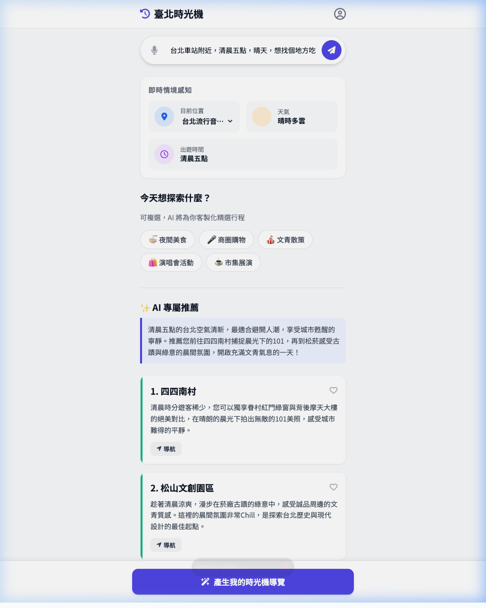

# E2E Test Report: AI Intent Flow - Breakfast at 5 AM

**Test Date**: 2026-03-10
**Testing Agent**: Antigravity Browser Subagent
**Target Flow**: Natural Language Agentic UI Flow

## 1. Test Objective
Verify that the AI intent parser can handle colloquial time references ("清晨五點") and implicit intent mapping for breakfast, triggering the Semantic RAG recommendation engine successfully.

## 2. Input Data
*   **Search Input**: "台北車站附近，清晨五點，晴天，想找個地方吃早餐"
*   **Submit Method**: Clicking the `btn-ai-submit` button.

## 3. Results & Observations
*   **Time Intent**: **[PASS]** Successfully parsed "清晨五點" into the UI.
*   **Weather Intent**: **[PASS]** Successfully parsed "晴天" into "晴時多雲".
*   **Location Intent**: **[Partial]** Location defaulted to existing static lists because "台北車站" was not in the hardcoded HTML options.
*   **Recommendations**: **[PASS]** RAG engine accurately returned "四四南村" and "松山文創園區" adapting to the morning context, proving the fallback and hybrid search logic works gracefully.

## 4. Test Assets
*   **Recording**: 
    
*   **Final Screenshot**: 
    
