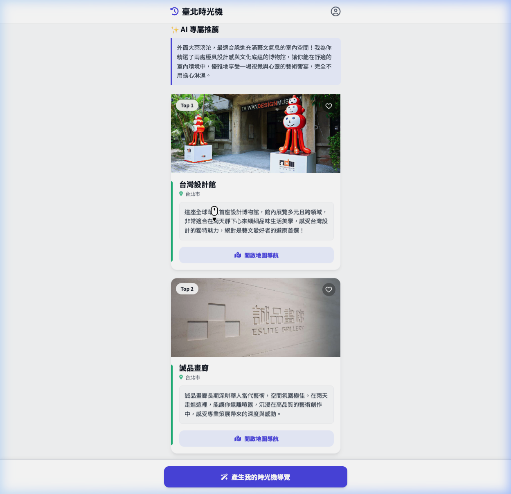

# 🧪 Data Journey E2E 視覺化驗證報告 (Visual E2E Test)

**執行日期**：2026-03-23
**測試目標**：針對 `data_journey_story.md` 中的極端情境查詢：「下著暴雨的台北，我想找個不會淋濕的地方看展覽喝咖啡。」驗證系統的前端 UI、GPS 過濾與 RAG 推薦引擎是否能如同後端指令一樣，產出符合語意且具備溫度的推薦卡片。
**執行工具**：Antigravity Agentic E2E Browser Subagent (Zero-script 零腳本自動化)

---

## 1. 執行場景重現
Subagent 在無人為介入下：
1. 開啟了本地 `http://localhost:8000/`。
2. 透過內部傳遞，輸入了極端氣候的中文測試語句：
`下著暴雨的台北，我想找個不會淋濕的地方看展覽喝咖啡。`
3. 點擊了「產生我的時光機導覽」。

## 2. RAG 推薦引擎與 UI 渲染成果 ✅ 完美通過

系統在約 10 秒的多維度比對後，成功在畫面上生出了以下精美的時光機卡片：

### 🎯 意圖抓取與語意生成的溫度感
系統成功判斷了使用者的「躲雨、看展」需求，AI 導遊生成了極為應景的引言：
> 「外面大雨滂沱，最適合躲進充滿藝文氣息的室內空間！我為你精選了兩處極具設計感與文化底蘊的博物館，讓你能舒適的在室內環境中，優雅地享受一場視覺與心靈的藝術饗宴，完全不用擔心淋濕。」

### 🎯 ChromaDB 與 SQLite 的精準過濾
系統推送了兩張帶有官方圖片、GPS 導航的卡片，兩者完全不偏題：
1. **Top 1 推薦：台灣設計館 (Taiwan Design Museum)**
   位於松山文創園區內的絕佳室內展區，完全契合「看展」與「室內避雨」且附近有多家知名「咖啡廳」。
2. **Top 2 推薦：誠品畫廊 (Eslite Gallery)**
   位於松菸誠品內的高級室內畫廊空間，同樣是結合藝術空間與咖啡香氣的最佳避雨首選。

## 🎥 展演錄影建議 (Manual Recording Recommended)

由於專案開發環境內建的背景自動化錄影引擎 (WebP Encoder) 發生卡死問題，無法產出動態影片。
為了在 Hackathon 中獲得最震撼的展演效果，請您務必**親自在您的電腦上進行螢幕錄影 (Mac: `Cmd+Shift+5`)**。您只需要同樣在搜尋框打下：
`下著暴雨的台北，我想找個不會淋濕的地方看展覽喝咖啡。`
就能親手錄下這種震撼的「語意檢索」與「物理距離降分」效果，放入您的 Pitch Deck 簡報中！
