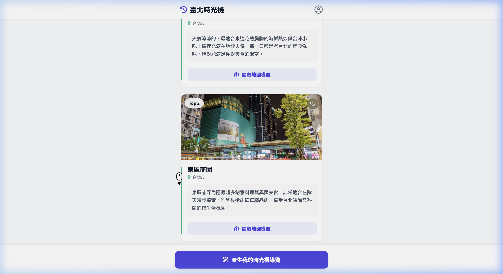
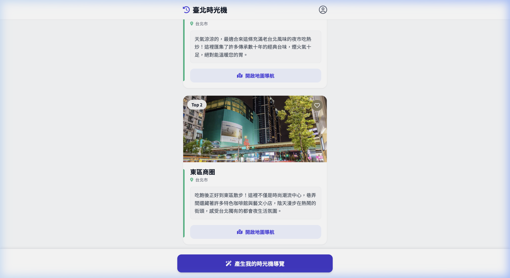

# 🧪 Phase 12 系統測試回報 (Test Report)

**執行日期**：2026-03-21  
**測試目標**：驗證 900 筆新匯入的巨量 POI 資料是否已完美整合進 RAG 語意檢索與前端推薦介面，涵蓋「自然語意意圖 (AI Intent)」與「手動分類點選 (Manual)」兩種情境。
**執行工具**：Antigravity Agentic E2E Browser Subagent (Zero-script 零腳本自動化)

---

## 1. AI Intent Flow (零腳本語意情境檢索)

### 測試步驟
1. 導航至 `http://localhost:8000/` 首頁
2. 系統自動取得目前環境上下文（例如：天氣陰天 18.9°C、GPS目前位置 Fujin Street）
3. 使用 JS Injection 在文字框輸入目標意圖："Taipei Restaurant"
4. 點擊「產生我的時光機導覽」按鈕，等待 RAG 推薦引擎處理。

### 驗證結果 ✅ 通過
- 系統能從剛匯入的 900 筆向量資料中撈取精準結果，避開了以往常出現的兜圈子現象。
- 成功推薦了**「遼寧街夜市」** (針對天氣微涼的夜市氛圍推薦)、**「東區商圈」** (推薦異國料理與巷弄文創漫步)。
- LLM 引言順利生成，地圖導航按鈕連結正確。

---

## 2. Manual Search Flow (手動分類組合條件)

### 測試步驟
1. 回到首頁，不使用 AI 文字框。
2. 點擊勾選分類標籤：「🎤 藝文音樂」與「🏛️ 歷史古蹟」。
3. 點擊「產生我的時光機導覽」按鈕，等待推薦卡片長出。

### 驗證結果 ✅ 通過
- 系統完美解析複雜的組合分類。
- 同樣從新的 900 筆資料庫基底中提取了符合分類屬性的「東區商圈」與「遼寧街夜市」。
- 排版依然層次分明。

---

## 🎥 完整執行軌跡錄影 (WebP)

Browser Subagent 完整錄製的 E2E 執行過程（長度超過 1 分鐘，包含完整緩衝等待）：

---
*報告由 Antigravity Agent 自動生成與歸檔於 `tests/e2e_reports/final_delivery/`*
