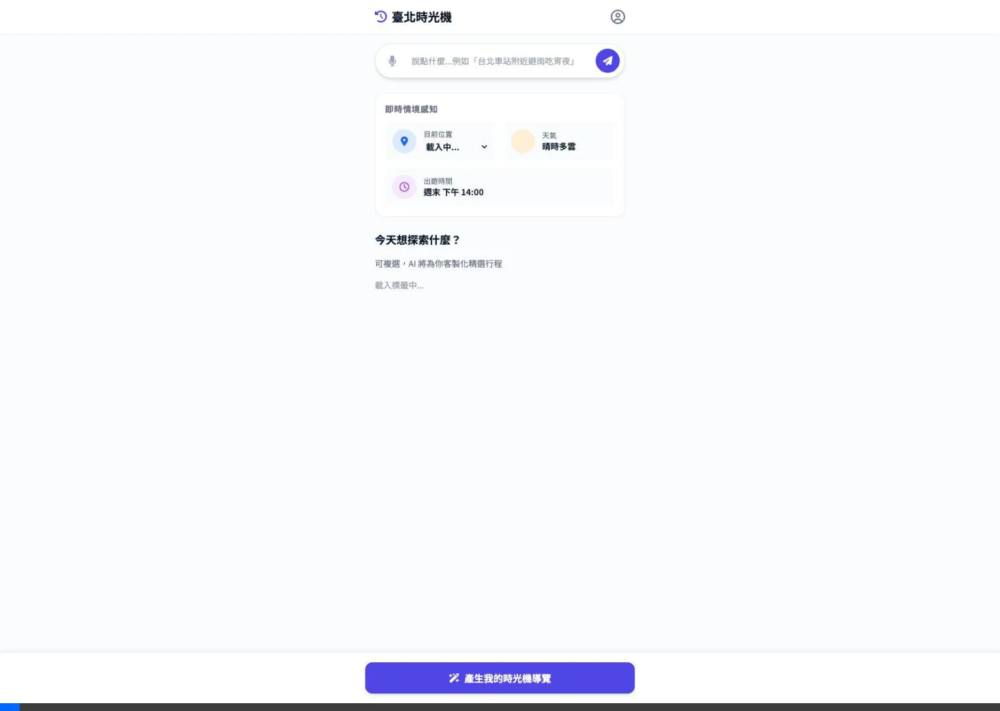
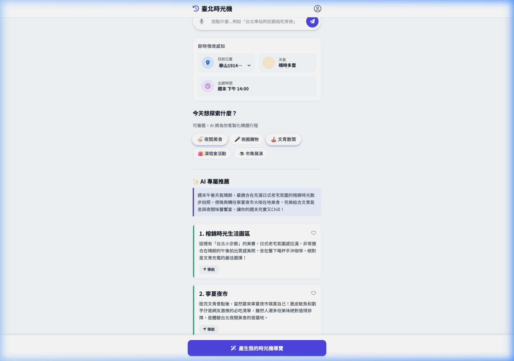

# E2E 測試報告：手動 UI 操作流程 (Manual UI Flow)

## 📅 測試資訊
- **測試日期**：2026-03-18
- **測試負責人**：Antigravity (Browser Subagent)
- **測試環境**：Localhost (FastAPI + ChromaDB)
- **測試結果**：🟢 **通過 (PASS)**

## 🎯 測試場景
驗證使用者在不使用 AI 搜尋框的情況下，手動透過下拉選單選擇地點、點擊興趣標籤，並觸發推薦生成的完整流程。

## 🛠️ 操作步驟
1. 進入首頁 `http://localhost:8000`。
2. 從「目前位置」選單中選擇：**華山1914文化創意產業園區**。
3. 從標籤區點選：**「🍜 夜間美食」** 與 **「🎪 文青散策」**。
4. 點擊按鈕：**「產生我的時光機導覽」**。
5. 等待 AI 生成結果。

## 📊 觀測結果
- **Metadata 載入**：地點與標籤皆正確從後端 API 取得並渲染。
- **UI 回饋**：點擊標籤後正確顯示 `.tag-active` 樣式。
- **API 串接**：點擊生成後正確呼叫 `/api/v1/recommendations/`。
- **推薦內容**：
    - **總結**：AI 成功揉合了週末晴朗天氣與華山周邊環境，提供導覽總結。
    - **景點**：推薦了「榕錦時光生活園區」與「寧夏夜市」，符合「文青」與「美食」的標籤定義。

## 📸 測試證物 (Assets)

### 操作錄影

### 最終結果截圖

---
*Generated by Antigravity AI Native Testing Suite.*
