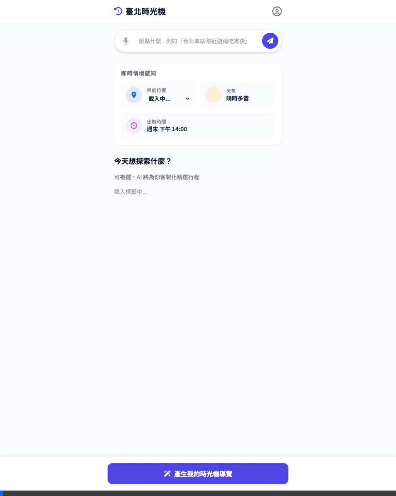

# E2E Test Report: Manual UI Flow - Xinyi Shopping District

**Test Date**: 2026-03-10
**Testing Agent**: Antigravity Browser Subagent
**Target Flow**: Traditional UI Clicking Pipeline

## 1. Test Objective
Verify the fallback functionality of the legacy "traditional click" flow. Ensure that manually changing dropdowns and tags, bypassing the AI search box, still triggers a 100% successful RAG recommendation cycle via the bottom Generate button.

## 2. Input Data
*   **Location Select**: Changed to "信義商圈".
*   **Tags Toggled**: "夜間美食", "商圈購物".
*   **Submit Method**: Clicking the large sticky bottom button `btn-generate`.

## 3. Results & Observations
*   **UI Resiliency**: **[PASS]** The tags successfully highlighted. The dropdown changed values triggering context updates.
*   **Loading State**: **[PASS]** Button showed the loading spinner during the generation phase.
*   **Recommendations**: **[PASS]** The recommendation text accurately summarized Shopping and Night Food in Xinyi, generating relevant cards like "饒河街觀光夜市".

## 4. Test Assets
*   **Recording**: 
    
